# Lean Inception

## Versionamento
| Versão | Data | Modificação | Autor |
|--|--|--|--|
|0.1| 24/10/2023 | Criação do documento | Lucas Gomes Lopes |

## Introdução
Uma Lean Inception é um workshop coletivo que visa alinhar o entendimento das áreas de negócio e técnicas sobre um produto em seus aspectos mais fundamentais. Segundo Caroli, o objetivo da Lean Inception é planejar o MVP, o Produto Mínimo Viável. A Lean Inception é compostoa por uma sequência de atividades colaborativas e dinâmicas que irão gerar o canvas MVP, o quadro visual que demonstra a estratégia do MVP <a href="#referencias">[1]</a>.

## Etapas 

### Visão do Produto
Esta atividade tem o objetivo de definir, de forma colaborativa, a visão do produto. Nessa etapa, a equipe se divide em grupos menores e preenche um template específico sobre a visão do produto. Por fim, os grupos se reúnem e discutem o resultado, podendo alterar o que foi feito anteriormente, de forma a se ter uma visão clara do produto ao fim da atividade <a href="#referencias">[1]</a>.

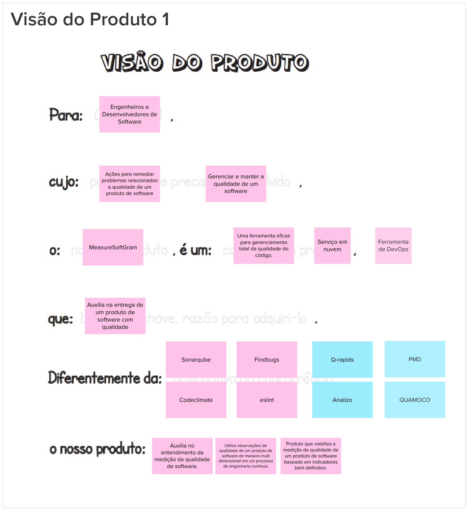
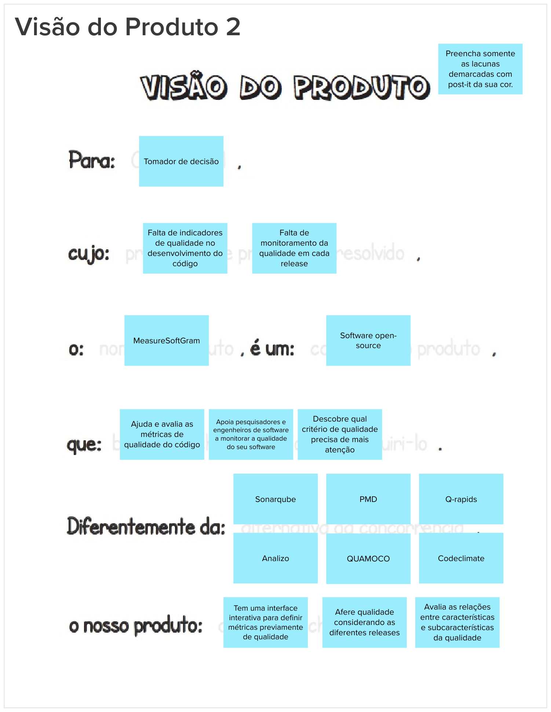
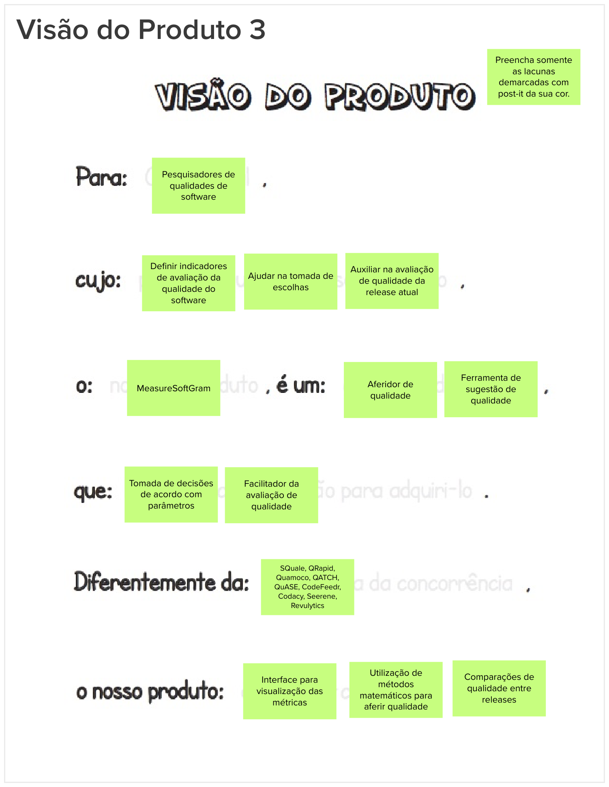

### O Produto É - NÃO É - FAZ - NÃO FAZ
Esta etapa busca classificar o produto seguindo as quatro diretrizes, indagando, especificamente, cada aspecto positivo e negativo sobre o produto ser ou fazer algo. O objetivo desta atividade é fazer com que os participantes tenham uma visão mais alinhada tanto
sobre o que o produto faz, quanto sobre o que o produto não faz <a href="#referencias">[1]</a>.  

### Objetivos do Produto
Nesta etapa, cada membro da equipe deve compartilhar sua compreensão sobre os objetivos do negócio, e os vários pontos de vista devem ser discutidos para chegar a um consenso sobre  o que verdadeiramente possui relevância. Portanto, esta atividade auxilia no levantamento e esclarecimento dos objetivos <a href="#referencias">[1]</a>.  
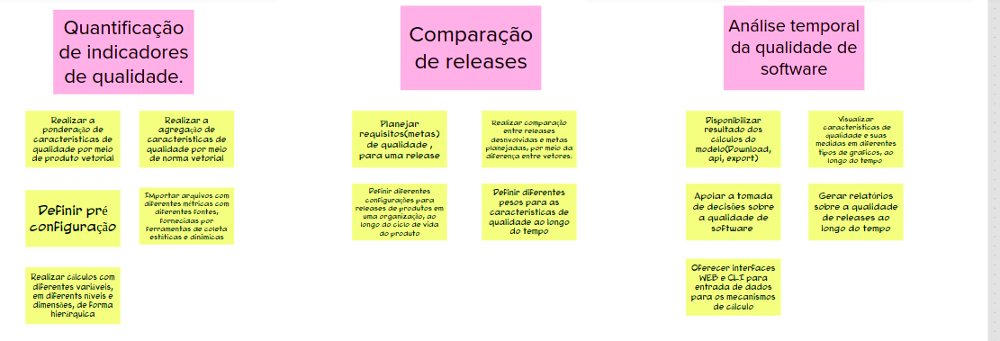

### Personas
Com o intuito de identificar as funcionalidades do produto, esta etapa utiliza a técnica de Personas. Uma persona é uma representação de um usuário do produto, descrevendo não só o seu papel, como também suas necessidades específicas. Essa representação realista de usuários
auxilia o time a descrever funcionalidades do ponto de vista de quem interagirá com o produto final <a href="#referencias">[1]</a>.  
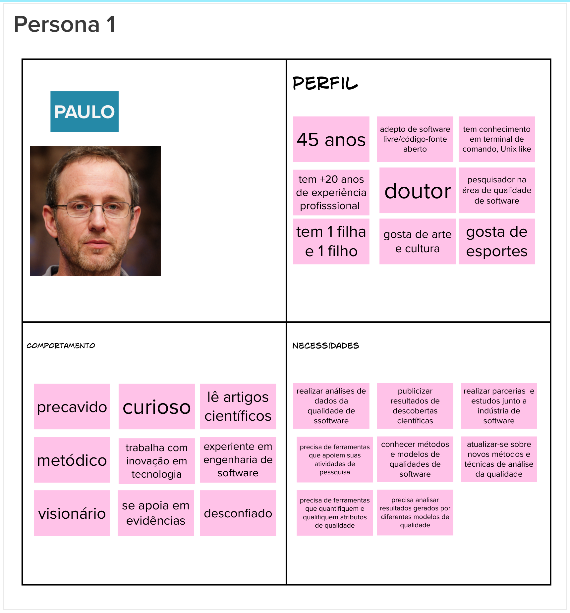

### Jornadas de Usuários
Essa etapa envolve a descrição detalhada do percurso que um usuário faz para alcançar um objetivo específico, sendo alguns desses passos do percurso representações de diferentes pontos de contato com o produto, caracterizando a interação da pessoa com ele. A partir dessa jornada, a equipe consegue levantar questões e opiniões sobre os desejos do usuário e as funcionalidades do produto <a href="#referencias">[1]</a>.

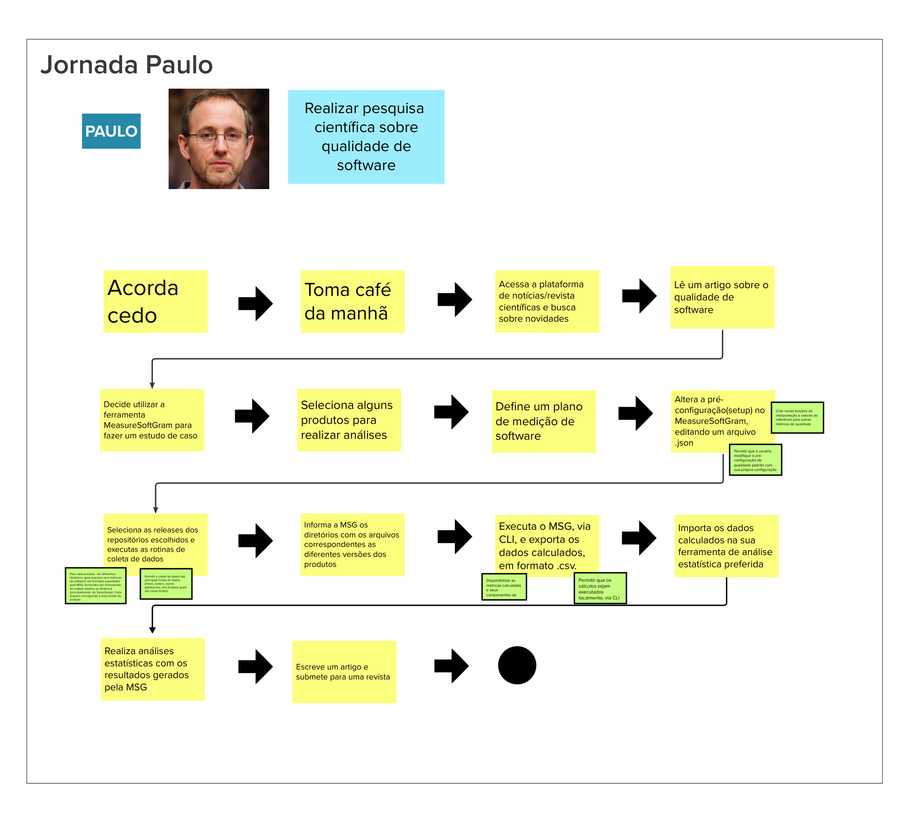
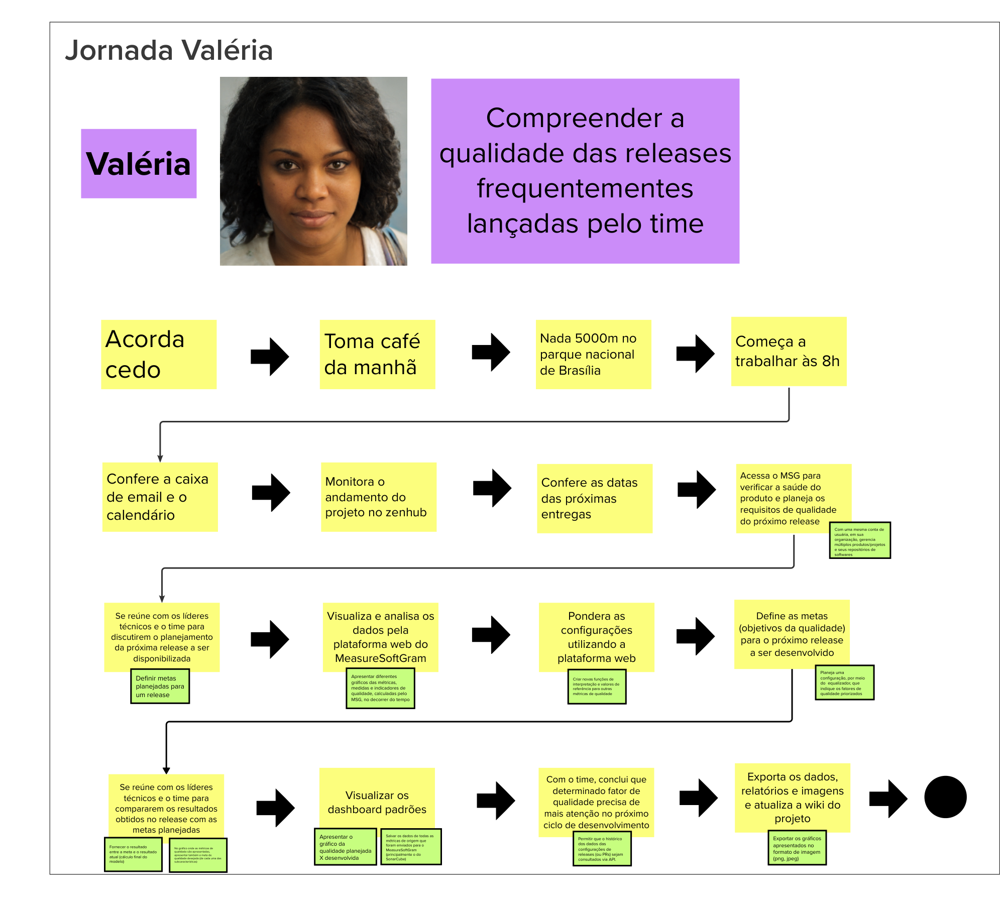
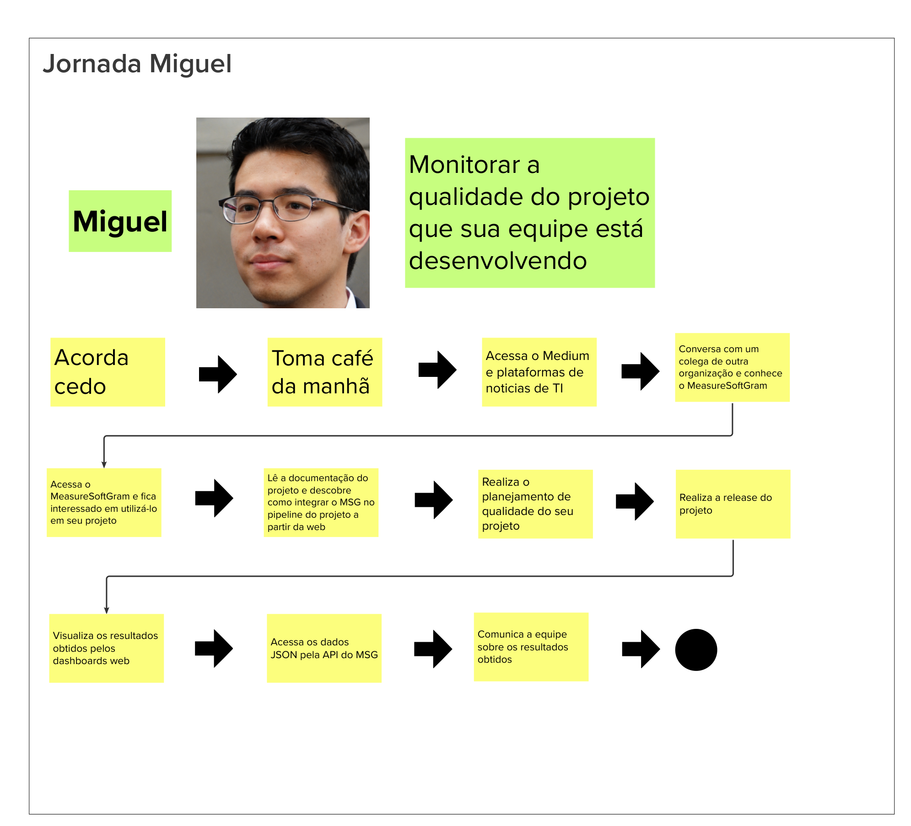
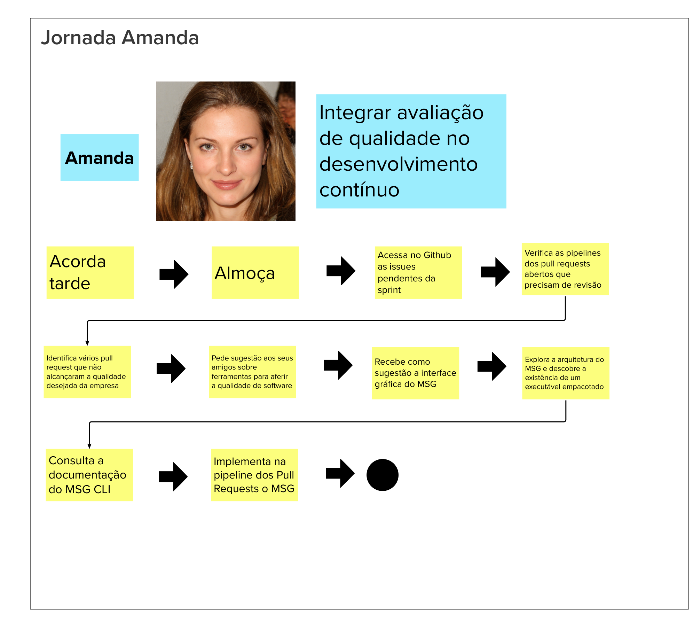

### Brainstorming de Funcionalidades
Utilizando como base a lista de objetivos do produto e as personas criadas nas etapas anteriores, os membros da equipe devem discutir entre si para identificar as funcionalidades do produto com base nas necessidades e objetivos de negócio dos usuários <a href="#referencias">[1]</a>.
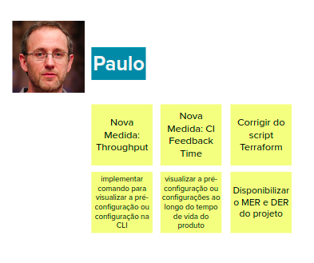
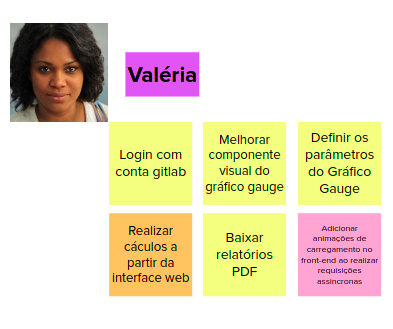
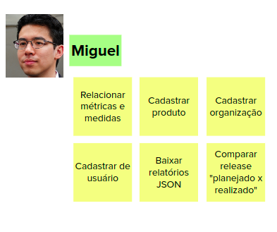
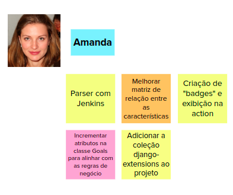

### Revisão Técnica, de Negócio e de UX
Esta etapa tem como objetivo avaliar as funcionalidades elencadas na atividade anterior. É preciso reavaliá-las, normalizá-las, e, se possível, descartar o que não faz sentido levar a diante. Para isso, cada funcionalidade é avaliada em termos de esforço, valor para negócio e experiência do usuário, com cada um desses fatores sendo avaliados em uma escala de um a três.
Além disso, cada funcionalidade também é avaliada sobre o nível de confiança que a equipe tem sobre o que ela é e como construí-la <a href="#referencias">[1]</a>.
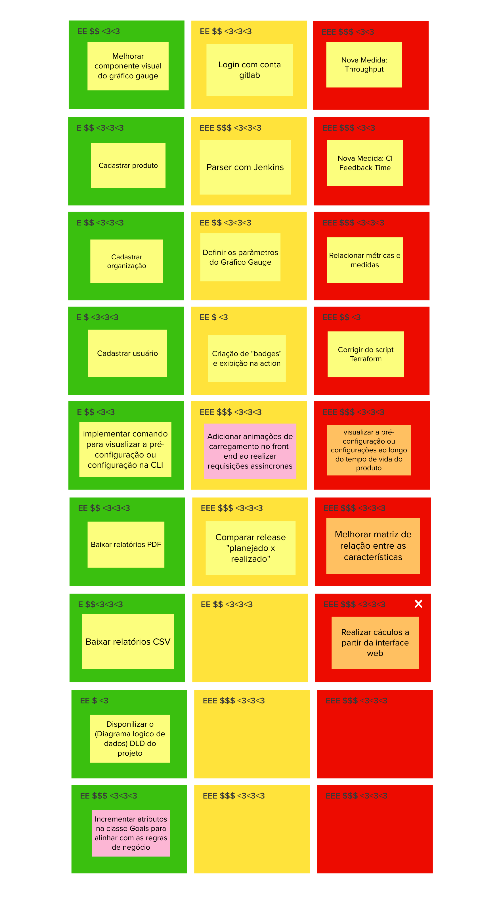

### Sequenciador
O objetivo desta etapa é priorizar as funcionalidades previamente identificadas e já avaliadas. Para isso, a equipe deve usar um template de um sequenciador e deve organizar as funcionalidades de forma sequencial, indicando o que será implementado no MVP e o que será incrementado. Além disso, a equipe deve definir quais funcionalidades estarão em cada onda, quantas ondas o MVP terá e qual o tamanho de cada onda. E para adicionar os cartões às ondas, um conjunto de regras deve ser seguindo <a href="#referencias">[1]</a>:
<ul>
    <li><b>Regra 1:</b> Uma onda pode conter, no máximo, três cartões.</li>
    <li><b>Regra 2:</b> Uma onda não pode conter mais de um cartão
    vermelho.</li>
    <li><b>Regra 3:</b> Uma onda não pode conter três cartões somente
    amarelos ou vermelhos.</li>
    <li><b>Regra 4:</b> A soma de esforço dos cartões não pode ultrapassar
    cinco “E”.</li>
    <li><b>Regra 5:</b> A soma de valor dos cartões não pode ser menos de
    quatro “$” e quatro corações.</li>
    <li><b>Regra 6:</b> Se um cartão depende de outro, esse outro deve estar
    em alguma onda anterior.</li>
</ul>

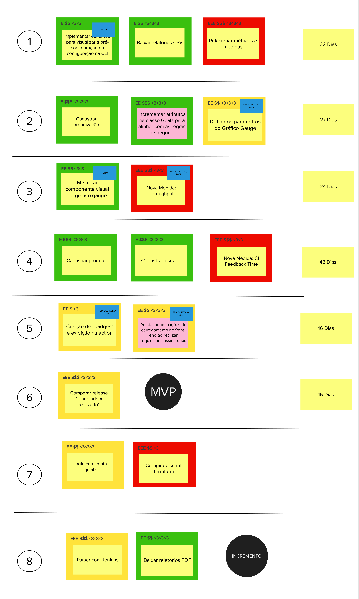

### Canvas MVP
No Canvas MVP, a equipe detalha o MVP e as suas funcionalidades, sob as perspectivas de Design Thinking e do Lean Startup. Apesar de poder ser utilizada independente da sequência de atividades da Lean Inception, ela foi concebida para ser a última do workshop. O Canvas MVP é dividido em sete blocos. E em cada bloco, uma pergunta deve ser respondida, na ordem indicada:
<ol>
    <li><b>Proposta do MVP:</b> Qual é a proposta deste MVP?</li>
    <li><b>Personas segmentadas:</b> Para quem é este MVP? Podemos
segmentar e testar este MVP em um grupo menor?</li>
    <li><b>Jornadas:</b> Quais jornadas são atendidas ou melhoradas com este MVP?</li>
    <li><b>Funcionalidades:</b> O que vamos construir neste MVP? Que ações
serão simplificadas ou melhoradas neste MVP?</li>
    <li><b>Resultado esperado:</b> Que aprendizado ou resultado estamos
buscando neste MVP?</li>
    <li><b>Métricas para validar as hipóteses do negóci:</b> Como podemos
medir os resultados deste MVP?</li>
    <li><b>Custo e Cronograma:</b> Qual é o custo e a data prevista para a
entrega deste MVP?</li>
</ol>

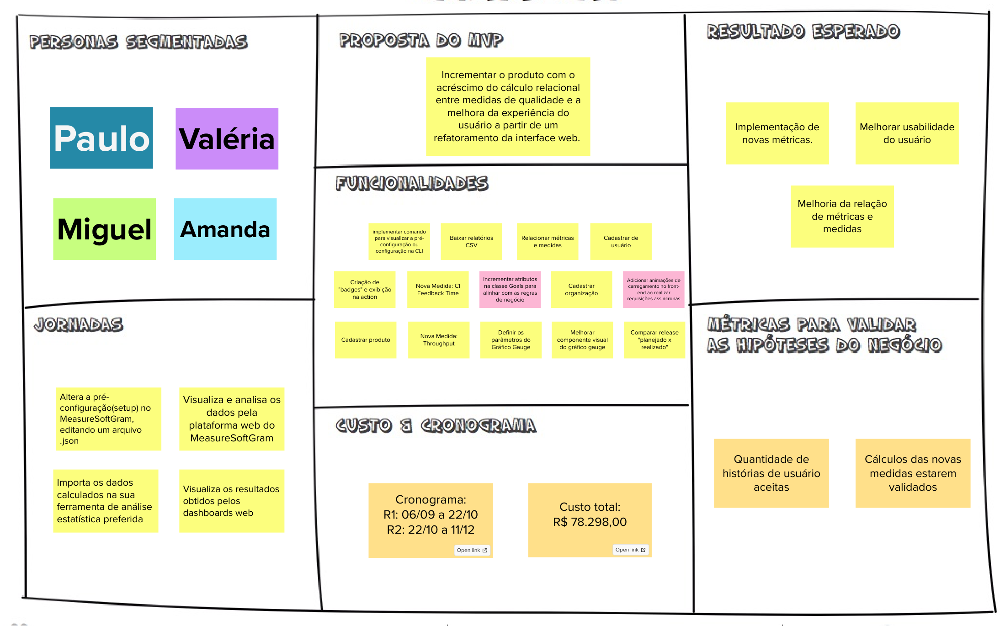

## Referências

[1] CAROLI, Paulo. Lean Inception: How to Align People and Build the Right Product. 1 ed. São Paulo: Caroli, 2018. Acesso em: 19 de out. de 2023.