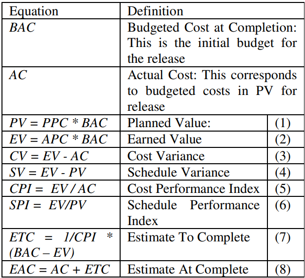

# Custos de projeto

## Objetivo do documento

Esse documento visa estimar os custos totais do projeto, baseado no custo da equipe, equipamentos e recursos necesários ao desenvolvimento, e possíveis custos para hospedar e manter o projeto.
    Todo o cálculo leva em consideração um cronograma bem definido para a duração da disciplina. 

## Custo por graduando
    
Baseado na matéria 'Raio-X do custo por aluno nas univerdades federais', publicada pelo jornal O Globo em 2016[1], o custo médio por ano de um aluno da Universidade de Brasília é de R$ 38.805,00.

Utilizamos então uma calculadora de ajuste de inflação do Banco Central do Brasil [6] para calcular o valor atualizado para o junho 2023. Para isso foi utilizado o índice de inflação IPCA (IBGE) com a data inicial em 01/2016 e a data final em 06/2023. Obtivemos o valor atualizado de  69.757,86 reais.

Desta forma, dividindo o custo anual por 12 para encontrar o custo mensal de um ano da UnB, temos que o custo mensal é de R$ 5813,16. E considerando que em média um aluno de graduação da Universidade de Brasília cursa 7 disciplinas por ano, o custo de um aluno por disciplina é de R$ 871,06. Uma vez que a discplina de EPS possui 60 horas de aula, o custo de um aluno por hora é de R$ 13,84, o que é compatível com o valor calculado pela apuração feita em [2].

Considerando uma média de 2 horas por dia gastas por aluno fora de aula, mais 60 horas de aula, e um período de 4 meses, temos 240 + 60 horas, totalizando 300 horas por aluno, 4500 para 15 alunos, que para os 13.84 calculados por hora, totaliza 62280,00 reais totais de custo de desenvolvimento.

## Custo de internet

| **Mensal por aluno** | **Mensal por grupo** | **4 meses** |
|----------------------|----------------------|-------------|
| R$ 100.00 | R$ 1500.00 | R$ 6000.00 |

## Custo de água

| **Mensal por aluno** | **Mensal por grupo** | **4 meses** |
|----------------------|----------------------|-------------|
| R$ 50.00 | R$ 750.00 | R$ 3000.00 |

## Custo de energia

| **Mensal por aluno** | **Mensal por grupo** | **4 meses** |
|----------------------|----------------------|-------------|
| R$ 80.00 | R$ 1200.00 | R$ 4800.00 |

## Custo de equipamentos

Para esse projeto precisamos de computadores pessoais, felizmente temos opções de qualidade e gratuitas,e/ou versões de estudante, dos softwares usados para desenvolvimento, então apenas precisamos definir requisitos mínimos para o computador, são eles:

- Deve possuir um processador Intel Core i5 da 11ª geração ou superior;
- Deve possuir 8 GB de memória RAM ou superior;
- Deve possui SSD de 256 GB ou superior;
    
Com base nessas especificações, foi feita uma pesquisa de preços de computadores com essas especificações e foi definido que o computador que melhor atende a essas especificações é o: Notebook Lenovo IdeaPad 1i 14" Intel i5 - 8GB 256GB SSD Placa de Vídeo Intel Iris Xe Windows 11 15.6" - 83AF0008BR por R$ 3.059,99.

Deste modo, o custo total de aquisição é o custo de 15 computadores, que é de R$ 45.858,85.

## EVM
A Gestão do Valor Agregado (GVA), também referida como Valor Agregado no Gerenciamento, é uma técnica de gerenciamento de projetos amplamente empregada para avaliar o desempenho efetivo de um projeto em comparação com o plano original. Essa abordagem combina dados relativos a despesas, prazos e realizações técnicas, com o objetivo de oferecer uma compreensão completa do avanço do projeto.

### Aquisição

| **Item** | **Preço unitário** | **Quantidade** | **Total** |
|----------------------|----------------------|-------------|-------------|
| Notebook lenovo | R$ 3.059,99 |  15 | R$ 45.889,85 |

### Custos relacionados

| **Tipo** | **Quantidade de alunos** | **meses** |**custo mensal** | **Total** |
|-----------|----------------------|-------------|-------------|-------------|
| Energia | 15 |  4 | R$ 80,00 | R$ 4800,00 |
| Água | 15 |  4 | R$ 50,00 | R$ 3000,00 |
| Internet | 15 |  4 | R$ 100,00 | R$ 6000,00 |
| Pessoal | 15 |  4 | R$ 1038,00 | R$ 62280,00 |

### Custo total
| **Tipo** | **Valor** |
|--------------|----------------------|
| Aquisição | R$ 45.889,85 |
| Geral equipe | R$ 76.080,00 |
| Total | R$ 121.969,85 |

Para o cálculo do EVM, foram utilizadas as seguintes fórmulas:

## Referências
**Raio-x do custo por aluno nas universidades federais.**. [1] . Disponível em: <https://infograficos.oglobo.globo.com/brasil/raio-x-do-custo-por-aluno-nas-universidades-federais.html>.

‌**Apuração do Custo do Ensino e do Custo Aluno, segundo a Metodologia de Apuração
desenvolvida pela UnB**.[2] Disponível em: <https://dpo.unb.br/images/phocadownload/documentosdegestao/relatoriogestao/2015/Apurao_do_Custo_do_Ensino_e_do_Custo_Aluno.pdf>.

‌**Notebook lenovo**.[3] Disponível em: <https://www.lenovo.com/br/pt/laptops/ideapad/serie-100/IdeaPad-1i-Gen-7-14-inch-Intel/p/LEN101I0030?cid=br:sem|se|google|j-b2c-gaming-convers-google-search-intelccf|search|gaming&gclid=Cj0KCQjwsp6pBhCfARIsAD3GZuaCZ9znZ5kATBbl4CpaO90gW6UNW6V8K63vjMOQfOv3XLKEqMd0sOYaAi9JEALw_wcB>.

‌**EVM**.[4] Disponível em: <https://ieeexplore.ieee.org/document/1667558>.

## Histórico de Versão

| Versão | Data | Descrição | Autor | Revisor |
|--------|------|-----------|---------------|-----------|
| 1.0 | 12/10/2023 | Versão inicial do documento | [Ariel Vieira Lima Serafim](https://github.com/ArielSixwings) | |